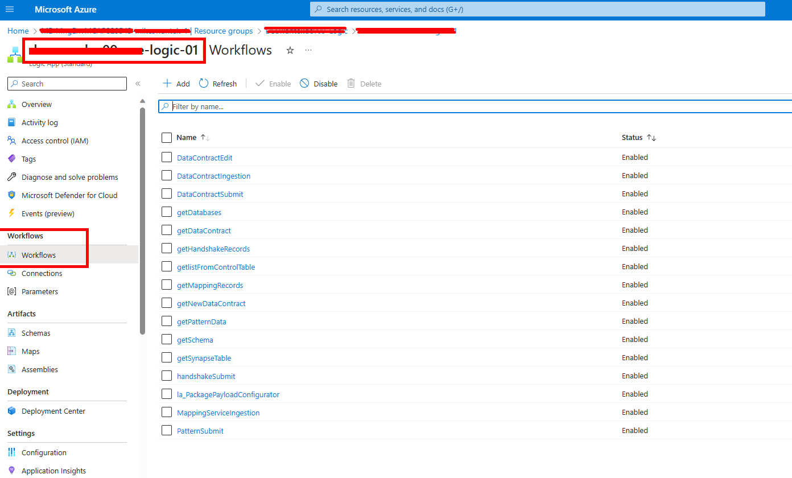
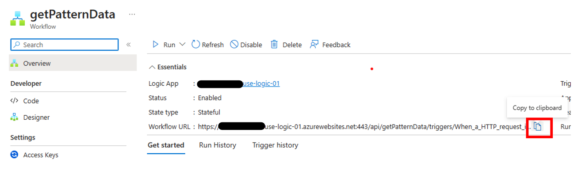
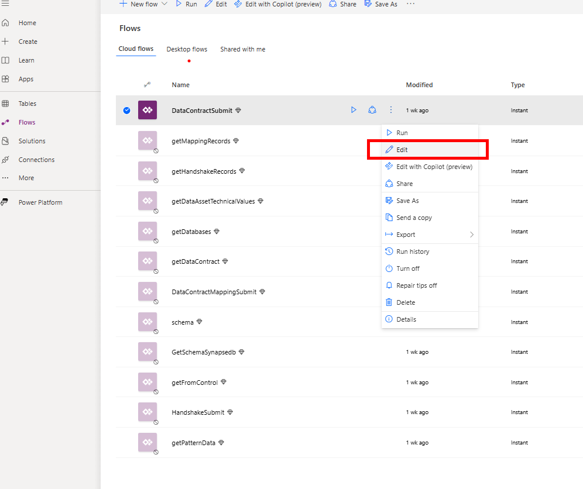

# ACTS Business Use Case Portal Deployment and Use

Configuration of ACTS VAT Tax Accelerator

Follow these steps to deploy and configure the ACTS Business Use Case Portal Power App for use.

1. Download the zip file from this repository.

    

2. Open the Power App environment. This eniornment is set up and supplied by the customer.

3. Add the following connection to the environment:

    - Microsoft 365 users connection - authenticate as admin of power platform (service account)

4. Select the Apps tab in the left navigation and then Import Canvas App that you downloaded locally, using the button in the header.
!   [img](img/powerappaddapp.png)

5. Select the upload button and navigate to the location of the package file from this repository.
    

6. On this screen, you can rename the app before it is added to the environment. Select the ‘wrench’ icon to change settings.
**Note that the flows needed to communicate with the Logic Apps are deployed with the app.**
    

7. The next step is to enable the flows. Navigate to the Flows section and notice that the flow is greyed out. This is because it is deployed in a disabled state. We must enable it for the solution to work.
Click the triple dots and select ‘Turn on’
    

8. Now we will get the uri address that from the Logic App. We must get the endpoint address of the Logic App and copy it first.

    - Navigate to the Logic App resource group in the subscription.
    - Open the DataContractIngestion Logic app.
    

9. Edit the Logic App in Designer mode
    

10. Now we will edit the uri address that points to the Logic App. Start by editing the flow. You will need to navigate back to the Power Apps environment.
    

11. Select the HTTP connector and paste on the value copied from the Logic App in step 11
    

12. Save the Power Automate Flow
    

13. Repeat this process for each of the Power App Flow and Logic App pairs shown in the table below.

    | Flowname | LogicApp called | SP it calls |
    | --- | --- | --- |
    | getMappingRecords | getMappingRecords | queries the mapping table |
    | getPatternData    | getPatternData    | queries the pattern table |
    | DataContractMappingSubmit | MappingServiceIngestion | InsertDataMapping |
    | getDataContract | getDataContract | queries the DataContract table |
    | GetSchemaSynapsedb | getSynapseTable | queries the information_schema.columns query  |
    | schema | getSchema | dbo.schemaDynamic (serverless) |
    | getHandshakeRecords | getHandshakeRecords | queries the dbo.handshake table  |
    | getFromControl | getlistFromControlTable | Queries the IngestedLandingDataAudit |
    | HandshakeSubmit | handshakeSubmit | usp_InsertHandshake |
    | getDatabases | getDatabases | Query: SELECT * FROM sys.databases  |
    | DataContractSubmit | DatacontractSubmit | usp_InsertDataContract |
    | DataContractEdit | DataContractEdit | usp_EditDataContract |
    | getDataAssetTechnicalValues| getNewDataContract |  usp_getDataContractRecordsDynamic |

    Now the required connections have been configured for the Power App and Flows.

14. Navigate to the Power App and Edit:
    

15. The first time this is edited, you will be prompted to connect to the needed connections. The system will install this as the user that is currently logged in, so be sure it is with the service account or admin account so that the connector will work for all users.
Click allow
    

    At this point the ACTS Business Use Case Portal Power App is configured and will now allow data registration into the control table.

## Using the Business Case Portal

There are 4 steps in application of the Business Use Case Portal for configuring data to be ingested and analyzed in the ACTS VAT Tax Accelerator:

    1. Create a ***Data Contract*** - a Data Contract is an agreement between a service provider (the Azure services we deploy are the services) and data consumers (customers and partners) that determines the management and intended usage of data between different organizations, or groups within an organization. The aim is to ensure reliable and high-quality data that can be trusted by all parties involved.  Data Contracts allow a service to define the entities they own, along with the schema, semantics, and various rules and thresholds such as those for data quality applicable to the data set defined in the contract. 

    2. Auto-generate the ***Handshake Service*** - a Handshake Service tracks and manages what and when data is published. This is the service used by the publisher to define specific information needed for the ingestion of data. It’s a job service that tracks and manages details needed for the automated data transfer from the source data to the data lake.

    3. Define the ***Data Mapping*** - The Data Mapping defines how attributes or fields in the input data map to specific fields in the Enterprise Tax Model.

    4. Trigger the ***Ingestion Service*** - the Ingestion Service applies information from the Data Contract and Handshake Service to configure the ingestion pipelines for publishing of data to the data lake. The Ingestion Service eliminates the need to develop code that delivers quality data to the data lake. The necessary staging and processing pipelines are provided by the Ingestion Service.
