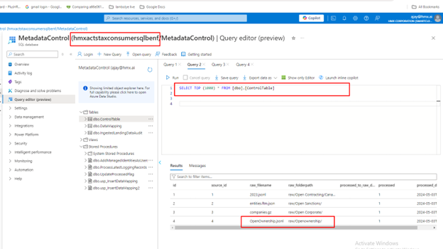

# ACTS Business Use Case Portal Deployment and 

The Procurement Accelerator, Data Management Infrastructure must be deployed prior to the steps below. See the [deployment document](DeliveryIP_GitHub/README.md) for step by step instructions on how to deploy the data management infrastructure and Azure Synapse components.

After deploying the infrastructure, follow these steps to deploy and configure the ACTS Business Use Case Portal Power App.

1. Download the zip file from [this repository](./BusiessUseCasePortal_20230928145456.zip).

    

2. Open the Power App environment. This environment is set up and supplied by the customer. From your browser log into your Microsoft account profile then access the Power Apps environment [at this URL](https://make.powerapps.com/).

3. Add the following connection to the environment:

    - Microsoft 365 users connection - authenticate as admin of power platform (service account).

    

4. Select the Apps tab in the left navigation and then Import Canvas App that you downloaded locally, using the button in the header.

    

5. Select the upload button and navigate to the location of the package file from this repository.

    

6. On this screen, you can rename the app before it is added to the environment. To rename, select the ‘wrench’ icon to change settings.
**Note that the flows needed to communicate with the Logic Apps are deployed with the app.**

    

7. The next step is to enable the flows. Navigate to the Flows section and notice that the flows are greyed out. This is because it is deployed in a disabled state. We must enable it for the solution to work.
Click the triple dots and select ‘Turn on’.

    

8. Next, obtain the URI address from the Logic App. We must get the endpoint address of the Logic App and copy it first.

    - Navigate to the Logic App resource group in the subscription.
    - Open the DataContractIngestion Logic app.

    

9. Edit the Logic App in Designer mode

    

10. Next edit the URI address that points to the Logic App. Start by editing the flow. You will need to navigate back to the Power Apps environment.

    

11. Select the HTTP connector and paste the value copied from the Logic App in step 10.

    

12. Save the Power Automate Flow

    

13. Repeat step 8 through 12 for each of the Power App Flows-Logic App pairs shown in the table below.

    | Flowname | LogicApp called | Description |
    | --- | --- | --- |
    | getMappingRecords | getMappingRecords | queries the mapping table |
    | getPatternData    | getPatternData    | queries the pattern table |
    | DataContractMappingSubmit | MappingServiceIngestion | InsertDataMapping |
    | getDataContract | getDataContract | queries the DataContract table |
    | GetSchemaSynapsedb | getSynapseTable | queries the information_schema.columns query  |
    | schema | getSchema | dbo.schemaDynamic (serverless) |
    | getHandshakeRecords | getHandshakeRecords | queries the dbo.handshake table  |
    | getFromControl | getlistFromControlTable | Queries the IngestedLandingDataAudit |
    | HandshakeSubmit | handshakeSubmit | usp_InsertHandshake |
    | getDatabases | getDatabases | Query: SELECT * FROM sys.databases  |
    | DataContractSubmit | DatacontractSubmit | usp_InsertDataContract |
    | DataContractEdit | DataContractEdit | usp_EditDataContract |
    | getDataAssetTechnicalValues| getNewDataContract |  usp_getDataContractRecordsDynamic |

    Now the required connections have been configured for the Power App and Flows.

14. Navigate to the Power App and Edit.

    

15. The first time this is edited, you will be prompted to enable the needed connections. The system will install as the user currently logged in, so ensure that you are logged in as a service account or admin account so that the connector will work for all users. Click allow to enable the needed connection.

    

The ACTS Business Use Case Portal Power App now is configured to allow data registration into the meta-data control table.

## Using the Business Case Portal

The Data Contract page is used to identify the sources of data from which Beneficial Ownership Engine input data will be extracted, validated, and reformatted. Seven (7) input files are required by the Beneficial Ownership Engine. These input data files including definition of contents and a step-wise method for collecting the data are described in [BeneficialOwnershipEngine-InputDataDescription](DeliveryIP_GitHub\BusinessUseCasePortal\BeneficialOwnershipEngine-InputDataDescriptions.pdf).

 The instructions described here enable you to generate the required 7 input data from JSON files downloaded from open data sources, including [Open Contracting Partnership](https://www.open-contracting.org/data/data-use/), [Open Sanctions](https://www.opensanctions.org/datasets/), [Open Ownership](https://register.openownership.org/download), and [Open Corporates](https://opencorporates.com/info/our-data/). Follow these steps to download and upload open source data to a storage container in Azure.
 
 1. Use the following links to download the data.

- [Open Contracting Partnership](https://data.open-contracting.org/): Select 'START YOUR SEARCH' and choose data for the country of interest.
- [Open Ownership](https://register.openownership.org/download): Select 'Download' to retrieve the file, which contains data for several countries (as of this writing it is ~3.5GB of data).
- [Open Sanctions](https://www.opensanctions.org/datasets/): Select 'Browse all 181 data sources...' and select the data source of interest. Note that OpenSanctions is free for non-commercial users, and businesses must acquire a data license to use the dataset.
- [Open Corporates](https://opencorporates.com/plug-in-our-data/): You can select 'SEARCH FOR FREE' to view the available data; however, a license is required to obtain the data.

Store the downloaded files in a convenient location. In a step below these files will be uploaded to an Azure container.

2. For each of these 4 data sources, a ***Data Contract*** and ***Handshake Service*** must be created. 

A Data Contract is an agreement between a service provider (the Azure services we deploy are the services) and data consumers (customers and partners) that determines the management and intended usage of data between different organizations, or groups within an organization. The aim is to ensure reliable and high-quality data that can be trusted by all parties involved. Data Contracts allow a service to define the entities they own, along with the schema, semantics, and various rules and thresholds such as those for data quality applicable to the data set defined in the contract.

A Handshake Service tracks and manages what and when data is published. This is the service used by the publisher to define specific information needed for the ingestion of data. It’s a job service that tracks and manages details needed for the automated data transfer from the source data to the data lake.

Complete the steps below for each of the 4 open data source files downloaded as described above.

3. From the  [Power Apps, Apps page](https://make.powerapps.com/), click on the Business Use Case application and when the application completes loading, press the 'Play' button at the top right to start the application and display the landing page.

4. Click the 'Access this service' button on the 'Data Acquisition Toolkit' panel to display the Data Acquisition Toolkit page.

5. Click 'Access this service' on the 'Data Contract and Shared Service' panel to display the Data Contract and Shared Service page.

6. Next, click the 'Create New Data Contract' button at the top right to display the 'Data Contract view Edit' page.

In the Data Contract, fill in as many fields as possible and note that the following fields are required:

- Subject Area,
- Data Source Name (Friendly),
- Pattern - for this Procurement Accelerator, only 'JSON' is supported,
- JSON File Name - use the example data to test, and
- Compression - choose 'None' if the file is a JSON or JSONL format or the appropriate compression if the files is compressed (zip, gz, etc.).

7. Click 'New Handshake' to create the data contract and display the Handshake Service information page.

8. Click 'Submit' to add the new Data Contract and Handshake Service information the meta-data database.

9. Log into the Azure Portal, search for `Synapse Analytics` to display a list of the Synapse instances deployed with the infrastructure, select the Consumer Synapse deployment, open Synapse Studio, click on the "Integrate" (pipe) icon in the left-hand panel, then click the "PL_GetLoggingUpdates" pipeline. Trigger this pipeline to update the MetaDataControl table with information from the Data Contracts created above.

10. Log into the [Azure Portal](https://portal.azure.com) and search for `SQL Database` instances. Click on the 'MetadataControl' SQL database that was created for the Consumer Synapse.

11. Use the Query editor to `SELECT` the top rows from `[dbo.[ControlTable]`. The query should return 4 rows like those in the figure below. Note the “raw_folderpath” and “raw_filename” shown in this table. 

12. In the Azure Portal, open the Consumer Synapse Studio, and click on "Linked - Azure Data Lake Storage Gen2" to see a list of containers and select the 'raw' container, where you can create the folders with the "raw_folderpath" obtained in step 11 above.

13. Finally, after creating the folders in step 12, upload each of the 4 downloaded files to the appropriate folder and with the "raw_filename" obtained in step 11 above.

Once (a) Data Contracts and Handshake Service are created for each of the 4 open data source files, and (b) the open data sources are uploaded to the Synapse "raw" container, then the Synapse pipeline can be triggered to automatically ingest and prepare data for the Beneficial Ownership Engine.

## Procurement Processing Pipelines

The Procurement processing pipeline is shown in the image below. Depicted at the top is the Business Use Case Portal Power App described herein. This Power App is designed to simplify the configuration of information, including Contract, Handshake, and Data Mappings, required for the Synapse pipeline execution.

Depicted on the lower half of the diagram are the pipeline processes. When data are uploaded to the landing zone storage account, Azure Data Factor pipelines are triggered automatically to convert and store the data in parquet file format in the raw zone. These data remain in the raw zone until you trigger the Synapse pipeline 'PL_1_MappingAndMoveToStaging', which automatically triggers pipeline 'PL_2_LoadToLakeDB'. These pipelines move the data from raw to staging to curated zones, where they are available to business consumers of the data in Excel, Power Bi line of business applications.
