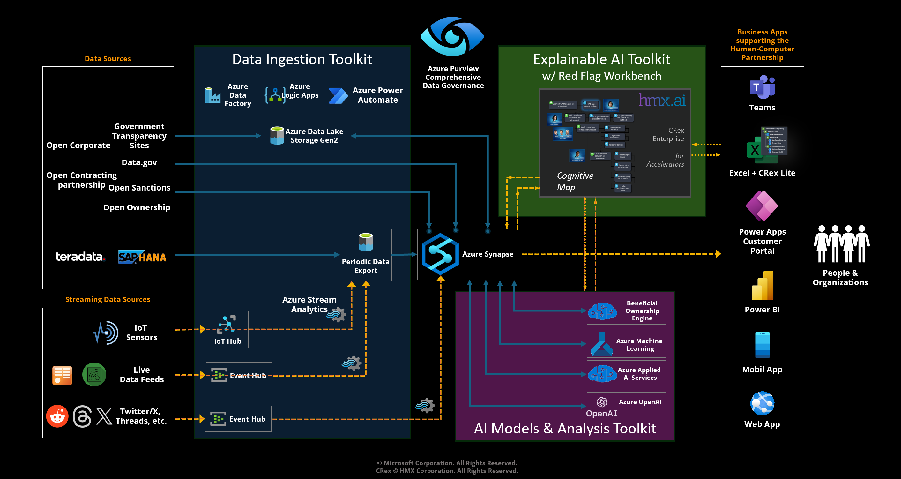

# ACTS Procurement Accelerator

Access to the ACTS Procurement Accelerator is by invitation.

The ACTS Procurement Accelerator includes the following capabilities:

1. **Data Management Infrastructure** - a comprehensive data strategy implementation including data ingestion, Azure Data Factory pipelines, Azure Synapse deployments including pipelines for development (staged) and consumer (curated) data management with associated storage containers, a common Enterprise Procurement Model (EPM), and a beneficial ownership data model. Data schema for the EPM adopts the [Open Contracting Data Standard](https://www.open-contracting.org/data-standard/), a comprehensive data standard designed to increase contracting transparency, and allow deeper analysis of contracting data by a wide range of users.
    - The deployment includes the [Business Use Case Portal](DeliveryIP_GitHub/BusinessUseCasePortal), a Microsoft Power App that is used to identify the location and filename for open data sources downloaded by a user and used to develop the input to the Beneficial Ownership Engine.
2. **Beneficial Ownership Engine** - A service that applies AI analysis techniques to detect complex relationships between procurement organizational entities and their activities.
3. **Power BI Templates** - For visualization of procurement compliance information and results of analysis performed by the ACTS Procurement Acclerator services.
4. **Example Data** - For testing all of the accelerator capabilities.

In addition, the following capabilities can be deployed with the ACTS Procurement Accelerator. Test data and preprocessing pipelines specific to the ACTS Procurement Accelerator implementation also are provided.

1. **Red Flags Workbench** - Excel-based procurement review flags (red flags or green flags) exploration and simulation.
2. **Information Assistant** - Enhanced generative AI supporting query of private procurement organization knowledge in a secure manner.

The steps required to deploy the ACTS Procurement Accelerator solution including example data and tools are described below.

## Deploy the Data Management Infrastructure & Development Synapse

The [deployment document](DeliveryIP_GitHub/) provides step by step instructions on how to deploy the data management infrastructure and Development Azure Synapse components. All required services, with developer access, will be in place after deployment. This allows immediate access to the services including those for data ingestion, data processing, and visualization with Power BI reports. Developers with knowledge of Azure Synapse, Azure Data Factory, and Power Platform can easily tailor the ACTS Procurement Accelerator to fit their specific use case needs.

The Development Synapse includes pre-packaged data pipelines that process data downloaded from open data sources and uploaded to the "landing" storage container (or "zone") of the data lake. Additional pipelines transfer data from the [Open Contracting Partnership](https://www.open-contracting.org/data/) and populate the development Enterprise Procurement Model (EPM) in the "staging" zone. The EPM in the staging zone provides access for developers and data scientists, with the necessary permissions, for analysis, machine learning, modeling, and other types of exploratory inspection and analysis.

## Deploy the Consumer Synapse

The next step is to deploy a separate Consumer Synapse environment with the common EPM and populate the consumer EPM with test data [See instructions here](DeliveryIP_GitHub/consumers/procurement/). The Consumer Synapse includes pre-packaged data pipelines that copy the EPM in the staging zone to the "curated" zone, which is the database of record. Additional pipelines extract data from open data sources and populate the Beneficial Ownership Model. Data in these models within the curated zone are used, with the necessary permissions, by management, business intelligence teams, and other data consumers for reporting, and processing external to the ACTS Procurement Accelerator environment.

### Deploy the Beneficial Ownership Engine

The ACTS Beneficial Ownership Engine (BOE) applies the [Transparency Engine](https://github.com/microsoft/transparency-engine) developed by Microsoft Research to create visualizations of the relationships between entities that must comply with procurement laws and policies. The BOE uses machine learning spectral embedding and graph analysis techniques to reduce complex sets of procurement information from open data sources to create a visual network that shows explicit, and possibly hidden, relationships between these entities. Hidden relationships are inferred based on similarities between attributes such as geographical location, names, addresses, and common activities (e.g, a buyer/seller relationship).

For the ACTS Procurement Accelerator, specialized Azure Synapse pipelines are provided for downloading BOE input data from open data sources including [Open Contracting Partnership](https://www.open-contracting.org/data/data-use/), [Open Sanctions](https://www.opensanctions.org/datasets/), [Open Ownership](https://register.openownership.org/download), and [Open Corporate](https://opencorporates.com/info/our-data/). See [Beneficial Ownership Engine Installation and Use](BeneficialOwnership/README.md) for information on deploying the BOE for use with the ACTS Procurement Accelerator.

The sample data are now ready to be accessed by Power BI from the Consumer Synapse EPM.

## Download the PBI Desktop Files

The Procurement and Beneficial Ownership Report Power BI file provides comprehensive reports on many aspects of procurement with a focus on review flag results, organized in many ways to simplify procurement risk and process performance management. It also contains the results generated by the Beneficial Ownership Engine including network graphs of static and dynamic activity relationships between procurement entities. The Power BI file is parameterized to connect to the EPM in the Consumer Synapse. See [Downloading and Using the Procurement and Beneficial Ownership Reports](DemoReports/README.md).

### Add Multi-language Support

ACTS Accelerators includes methods and tools to support multiple languages in Power BI reports. These methods enable users to modify labels on visuals, add languages, and manage these labels and languages to tailor reports in specific implementations. The steps to deploy multi-language support for this Accelerator can be found in the [Multi-language Support](MultiLanguageSupport/) section. This section includes a document with deployment steps and an example Power BI file that implements multi-language capabilities described in the document.

## Additional Accelerator Capabilities

The ACTS Procurement Accelerator components support the following additions, which are deployed separately.

### Red Flags Workbench

The Red Flags Workbench is a Microsoft Excel Add-in designed to allow managers and analysts to explore standard procurement red flags available in a library that is based on the [Open Contracting Data Standard](https://www.open-contracting.org/data-standard/), create their own red flags, modify how red flags are assessed, and perform simulations scenarios with a subset of their procurement data. The Add-in applies the familiar capabilities of Excel so that business users can easily create and maintain their red flags. The Add-in's Cognitive Map structure provides a context for organizing red flags in a way that keeps organizations focused on goal achievement and maintaining procurement compliance situational awareness. See [Red Flags Workbench Installation and Use](RedFlagsWorkbench/README.md) for information on deploying the workbench for use with the ACTS Procurement Accelerator.

### Information Assistant

The ACTS Information Assistant applies the [Microsoft Public Sector Group's Information Assistant](https://github.com/microsoft/PubSec-Info-Assistant) to enable use of OpenAI large language models for data retrieval and ChatGPT-style Q&A interactions in a secure manner with a procurement organization's private information. The Information Assistant uses Retrieval Augmented Generation (RAG) with Azure OpenAI's GPT models and Azure AI Search to discover relevant responses to user queries through simplified data ingestion, transformation, indexing, and multilingual translation services. Procurement organizations that deploy this capability can upload PDF, CSV, Excel, and image files and then engage in Q&A sessions relevant to the content of the private data. The Information Assistant is designed to address specific concerns of organizations that require natural language capabilities that are:

- **Current**: Based on the latest private data updates.
- **Relevant**: Responses tailored to the content of the uploaded private data.
- **Controlled**: Adjusted responses to provide the desired level of detail.
- **Referenced**: Provides citations from the uploaded knowledge sources.
- **Personalized**: Responses adjusted to your selected persona.
- **Explainable**: Provides information on the thought process that generated the response.

See [Information Assistant Deployment and Use](InformationAssistant/README.md) for information on deploying the Information Assistant for use with the ACTS Procurement Accelerator.

## Contributing

This project welcomes contributions and suggestions.  Most contributions require you to agree to a Contributor License Agreement (CLA) declaring that you have the right to, and actually do, grant us the rights to use your contribution. For details, visit <https://cla.opensource.microsoft.com>.

When you submit a pull request, a CLA bot will automatically determine whether you need to provide a CLA and decorate the PR appropriately (e.g., status check, comment). Simply follow the instructions provided by the bot. You will only need to do this once across all repos using our CLA.

This project has adopted the [Microsoft Open Source Code of Conduct](https://opensource.microsoft.com/codeofconduct/).
For more information see the [Code of Conduct FAQ](https://opensource.microsoft.com/codeofconduct/faq/) or
contact [opencode@microsoft.com](mailto:opencode@microsoft.com) with any additional questions or comments.

## Trademarks

This project may contain trademarks or logos for projects, products, or services. Authorized use of Microsoft trademarks or logos is subject to and must follow
[Microsoft's Trademark & Brand Guidelines](https://www.microsoft.com/en-us/legal/intellectualproperty/trademarks/usage/general).
Use of Microsoft trademarks or logos in modified versions of this project must not cause confusion or imply Microsoft sponsorship. Any use of third-party trademarks or logos are subject to those third-party's policies.
