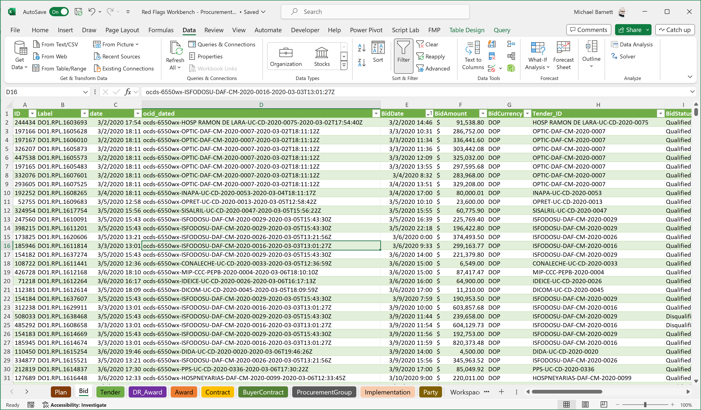
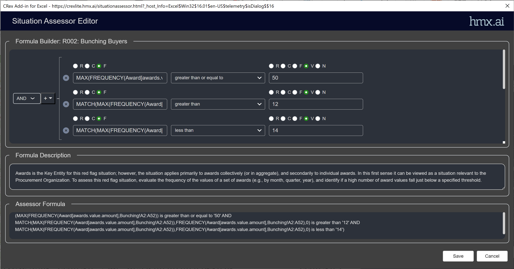
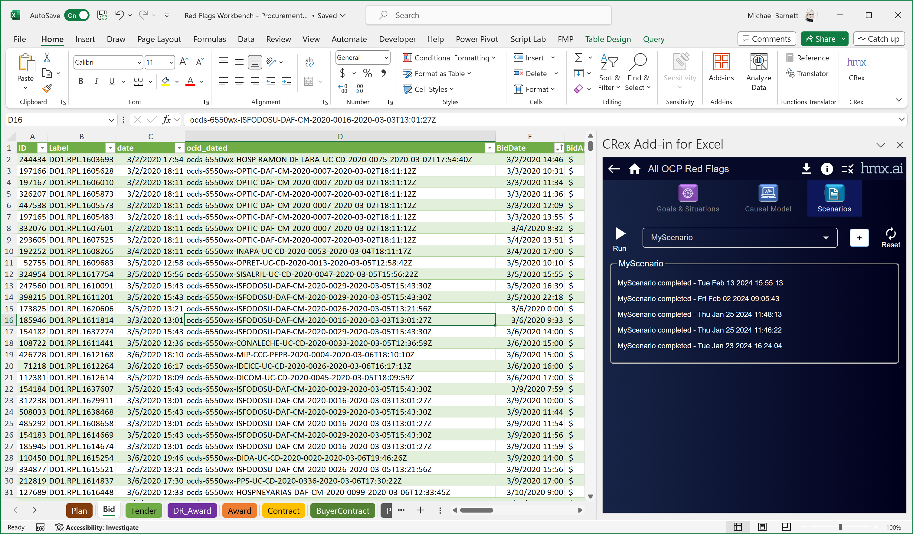
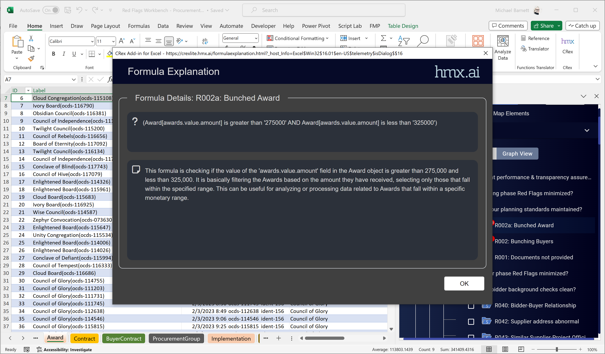

# ACTS Red Flags Server and Excel Workbench Add-in

The ACTS Red Flags Server is an Azure service that enables you to define critical risk signals to monitor and maintain a database of red flags that occur based on procurement data. The Excel Workbench Add-in is applies the [HMX.ai CRex Add-in for Excel](https://appsource.microsoft.com/en-us/product/office/WA200005695?tab=Overview). CRex Add-in for Excel is free to download from Microsoft AppSource. Both the Red Flags Server and The Excel Workbench have the following key features:

- **Goal-Oriented** - Define procurement authority goals most relevant to managing compliance and transparency.
- **Situation-Centric** - Define the critical situations that a procurement authority wants to uncover and track to determine the best actions to take.
- **Cognitive Maps** - Organize goals and situations in a graphical 'Cognitive Map' that represents procurement authority compliance management plans.
- **Simulation Scenarios** - Run simulations for what-if scenarios and fine-tune the procurement authority compliance management plans.
- **CoPilot Integration** - Investigate how decisions impact procurement organization goal achievement and situational awareness with natural language Q&A.

## Red Flags Server

(TBD Introduction)

### Configuration and Deployment

(TBD - Describe what parameters need to be configured and steps for how to deploy)

### Functional Test

(TBD-an easy way to start the test and confirm operation of the Red Flags Server)

## Red Flags Workbench Excel Add-in

## Prerequisites

- Microsoft 365 subscription
- Internet access
- Access with appropriate credentials to your data sources

## Getting Started

The Workbench uses the familiar capabilities of Excel to simplify creation and management of red flags. The Red Flags Workbench Excel file provided in this repository includes example data tables created from public data sources. You can use this workbook to become familiar with the Workbench Add-in capabilities. You can also create and manage your own red flags using data that you add to Excel by following the steps below.

1.Download the 'Red Flags Workbench - VAT Tax.xlsx' Excel Workbook provided in this repository folder and open the file within Excel.

2.Obtain the HMX.ai CRex Add-in for Excel from the Excel 'File-Get Add-ins' menu item.

    - Search AppSource for 'HMX' then click Add next to 'CRex Add-in for Excel'.
    - Click the 'HMX CRex' button on the right-hand side of the Excel Home ribbon to open the Add-in.
3.Organize your data in Excel tables.

    - You can use any data, organized in Excel Tables.
    - To add your own data, use Excel's Data ribbon to get the data you want to analyze and copy it to an Excel worksheet. 
    - Each table is a Key Entity in your analysis. Key Entities are what you’re monitoring to achieve your goals. For example, taxpayers, invoices, etc.
4.Create a Cognitive Map.
    - On the Add-in landing pane, Click **+** (see figure above) to build your own Cognitive Map.  A Cognitive Map contains the goals you wish to achieve, and the situations that impact them.
5.Create your Cognitive Map as a tree view of your Goals and the important Situations that impact each Goal.

    - **Goals** are objectives you want to achieve, like ensuring customer satisfaction, procurement integrity, or maximum ROI.
    - **Situations** are the Red Flags (these are used as synonyms below), the conditions that impact achievement of your goals, like compliance red flags.
    - **Key Entities** are contained in the Excel tables you inserted into your workbook. They are what you’re monitoring to achieve goals. For example, taxpayers, or invoices. Red Flag are always associated with your key entities, for example, late tax filing is a red flag associated with taxpayer key entities.
    - **Goal Impact** measures the favorable or negative impact of a red flag when it is present. A positive Goal Impact indicates a favorable or desirable "review" or "green flag". A negative Goal Impact indicates an adverse or undesired red flag.
6.Define how you assess whether a red flag is present, based on your data, by entering an Excel formula for each red flag Assessor.

    - To Enter a red flag Assessor, click the ***f*x** button in the Situation Specification section. This will display the Situation Assessor Editor and Formula Bulder.
        - A Assessor evaluates the presence or absence of the flag.
        - Build your formula in chunks, connected by AND or OR.
        - Use the radio buttons just above the text boxes to specify what you want to enter:
            - **R** = a cell reference for example, Customer!B2
            - **C** = an table structured reference for example, TaxPayer[VATGap]
            - **F** = an Excel formula for example, 0.3 * TaxPayer[Revenue]
            - **V** = a value for example, “active”, 12.3, or “5/2/2023 12:00:00 AM”
        - Select an operator from the center drop-down menu.
        - Use the AND/OR drop down to build the complete formula.

        The Add-in will automatically translate the information you entered to a valid Excel formula shown in the Assessor Formula text box.

    - Enter a Formula Description to describe how the flag is assessed.
7.Now that you have entered Excel data tables and have a Cognitive Map of Goals and Red Flag Situations with Assessors, you can run what-if simulations to see what red flags are present and how they impact Goal achievement.

    - At the top of the Add-in click the Scenarios button to move to the Scenario Simulation pane.
    - Create a Scenario by clicking the **+** button and entering a name for your Scenario.
    - Click the Run button to start a simulation.

    During a simulation, the Add-in assesses each of the red flags you defined for the data you have provided. The Add-in automatically evaluates Goal Achievement based on whether flags are present. Adverse or red flags reduce Goal Achievement while Favorable or green flags increase Goal Achievement.
8.Run and review reports and locate the data causig the presence of a red flag.

    - The Workbench Add-in creates 3 different reports that you can review including:  
        - ***SitRep*** (Red Flags Situation summary) with each red flag organized by count (the number of red flags present), key entity, and goal impact.
        - ***Goal Satisfaction*** goal satisfaction as a percent for each goal.
        - ***Goal Impact*** the impact of each red flag by each goal.

    - Click on the Goals & Situations button at the top of any Workbench Add-in pane and scroll down to the Cognitive Map. The red notiifcation badges indicate the number of flags present for each of the specified flag situations (recall that they can be either red or green flags).
    - Click on a flag badge that displays a non-zero value. A list will be displayed where each item is one of the Key Entities, for example a taxpayer or invoice, for which the flag was assessed to be present. 
    - Click on any item in the displayed list and the focus will shift to the row in the Key Entity table containing the data that caused the flag to be assessed as present. You can then examine these data to understand the cause of the flag.
9.Use OpenAI to obtain explanations of your Red Flag Situation definitions.

    - In the Cognitive Map display, mouse over the red flag and select the information ***i*** icon. This will display the red flag formula you entered together with an explanation in natural language.
